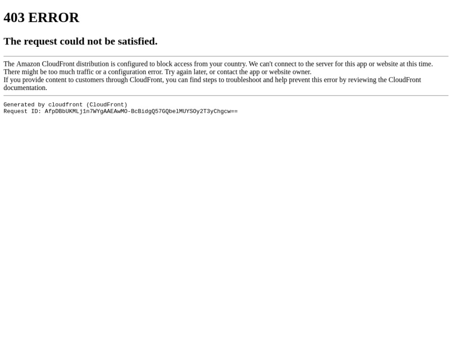

Title: Issues preventing downloads and registration
Status: Submitted, pending confirmation of receipt.
IssueMaintainer: ghuntley
---

# April 30th, 2020 - Australian Financial Review

https://www.afr.com/politics/federal/tech-community-backs-covidsafe-app-20200430-p54olb

<!-- 

-->

> Over 500 met on Wednesday evening by video, after multiple developers and software engineers had reverse-engineered the code base and inspected it for security, integrity and usability.

<?# YouTube U3dN99ljgD4 /?>

> Led by Queensland open-source software engineer Geoff Huntley, a group of developers and programmers have collated the findings of about a dozen different efforts to review the code and the usability of the app
>
> Mr Huntley told the meeting the group was ready to share their findings with the government's developers to help debug and improve its usability.
>
> The group met up after Atlassian co-founder Mike Cannon-Brookes called on developers and software engineers to help debug the application.
>
> Mr Huntley detailed the issues the group had identified with the app.

https://docs.google.com/presentation/d/1EELQ38POzp3AfnXhPcCZgPGcdlMaXLIqd3IA9t56HxE/preview#slide=id.g8453a0d5d1_0_300

Attachment:
- <a href="covidsafe-app-teardown-slide-deck.pdf">covidsafe-app-teardown-slide-deck.pdf</a>

# Elderly cannot register because the PIN times out too fast

<?# Twitter 1258874352864342016 /?>
<?# Twitter 1259072590959669249 /?>

# People cannot register when on WiFi

<?# Twitter 1254756428994146305 /?>
<?# Twitter 1254778371180883968 /?>

<?# Twitter 1254910471972380672 /?>
<?# Twitter 1254717778809913345 /?>
<?# Twitter 1254714439997091848 /?>
<?# Twitter 1254687792841371650 /?>

# Only available in the Australian App Store

The iOS version of the app is limited to the Apple Australian App Store only.

This can be verified using https://gist.githubusercontent.com/hellozimi/223ce5f4fb0213a92b06/raw/38b2d47f0662bf8ce7fc92c35ac05d0751857174/app.py with the argument `1509242894` which is the application identifier for COVIDSafe.

Singapore identified this issue and responded by adding UK & US stores (source, Version 1.5 Release notes).
Also confirmed by script

app.py 1498276074 (1498276057 is id of TraceTogether)
Available in United Kingdom, Singapore, United States

DDG search- https://duckduckgo.com/?q=tracetogether%2Fid1498276074+site%3Aapps.apple.com& - suggests also iin sg/gb/us + tw, nl, es, fr, kr, jp

<?# Twitter 1254952458310176768 /?>
<?# Twitter 1254952008424894465 /?>

# Cannot register if name fails validation

<?# Twitter 1254818517242675202 /?>

# Rural Australians cannot register

<?# Twitter 1254499854245433344 /?>
<?# Twitter 1255606745725931520 /?>

> Many rural Australians aren't able to register for the app at all.
> 
> In order to register for COVIDSafe, users need to be sent an SMS verification. This two-factor authentication (2FA) is for security purposes and in general is a good feature of the app.
> 
> But this becomes problematic if you live in an area with patchy or no mobile service. And this is the issue that many rural Australians are now facing. If you can't get the SMS, you can't use COVIDSafe.
> 
> For rural Aussies – or even just those who live in a mobile black spot – who are on plans with Vodafone and Optus, excluding prepaid, this isn't a problem. With these providers, they're able to still receive the verification text because these telcos offer SMS Over WiFi.
> 
> Unfortunately, users who are with Telstra or some Mobile virtual Network Operator (MVNO) resellers don't have the SMS over WiFi option.

https://www.gizmodo.com.au/2020/04/some-rural-australians-cant-access-covidsafe-app-due-to-a-missing-telstra-feature/

> Over the past week we have been hearing about issues that some rural Australians are having installing the COVIDSafe app. This is because Telstra, unlike Vodafone and Optus, didn't have SMS over WiFi, which prevented 2FA texts from being received by people who don't have mobile phone reception. Importantly, is an issue that also impacts other 2FA SMS as well as emergency texts. During our investigation into this Telstra started quietly rolling the feature out.
>
> We knew Telstra was going to be looking at finally rolling out SMS Over WiFi, but the telco was unable to provide Gizmodo Australia a clear timeline. It appears the decision may have been tied to COVID-19 and the need for the COVIDSafe app in rural communities. Comments received from both Telstra and the Federal Minister for Communications Paul Fletcher to Gizmodo last week indicated that the telco was working on a solution to 2FA for the COVIDSafe app specifically.
> 
> "Telstra customers in areas that do not have mobile coverage are unable to send or receive SMS over WiFi. We have been working to introduce this capability into the network and will now accelerate the work required. We are also working closely with the DTA on alternative methods for the COVIDSafe app to send an authentication code," a Telstra spokesperson said in an email to Gizmodo Australia.
>
> "SMS over WiFi updates for customers’ smartphones have gone live overnight and will roll out progressively over the next seven days. Some Telstra customers will already see the functionality available on their devices." said a Telstra spokesperson in an email tp Gizmodo Australia.

https://www.gizmodo.com.au/2020/05/telstra-sms-over-wifi-launch/

<?# Twitter 1257902961780387840 /?>

# Norfolk Island residents cannot register

Norfolk Island is an external territory of Australia but uses a different country code, `+672` instead of `+61`. This means Norfolk Island numbers cannot be used to register for COVIDSafe.

# People who are roaming with an international SIM cannot register

COVIDSafe requires an Australia mobile number beginning with `+61` to register, meaning foreigners in Australia need a local sim card. People who are roaming with an international SIM and are located within Australia cannot register for COVIDSafe.

